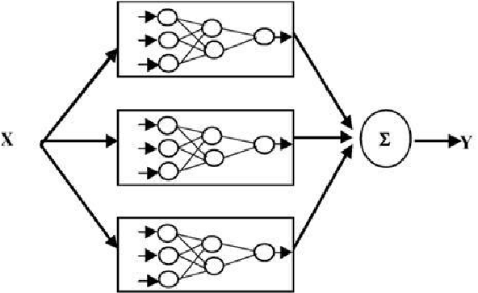
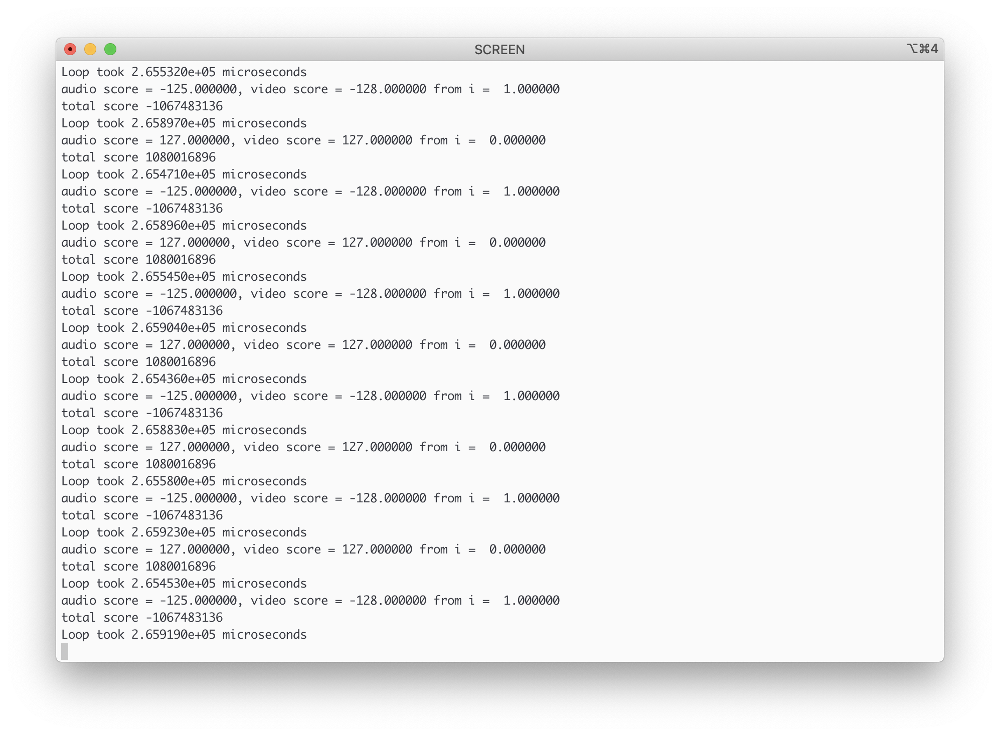
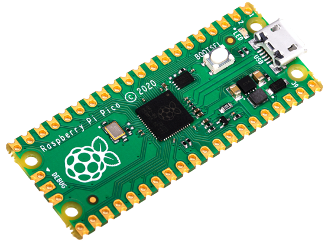

# Multi-Domain AI with the Raspberry Pi Pico

This project is a proof of concept of running two neural networks
simultaneously (one on each core) on the Raspberry Pi Pico. An audio classifier
and video classifier are run at the same time to detect emotion. Using two
models leads to higher confidence and has many potential applications.


> Image taken from
> https://www.researchgate.net/figure/A-multiple-neural-networks_fig1_277184850

## Contents

- [Overview](#overview)
- [Installation / Setup](#installation--setup)
    - [Quick Setup with `uf2`](#quick-setup)
    - [Build with Docker](#build-with-docker)
    - [Build Yourself](#build-yourself)
- [Statistics](#statistics)
- [Deep-Dive](#deep-dive)
    - [Multi-Domain Neural Networks](#multi-domain-neural-networks)
    - [Raspberry Pi Pico](#raspberry-pi-pico)
    - [Tensorflow Lite for Microcontrollers](#tensorflow-lite-for-microcontrollers)
    - [Code](#code)
        - [Setting Up](#setting-up)
        - [Inference](#inference)
        - [Multi-Processing](#multi-processing)
- [Other Use-Cases](#other-use-cases)

## Overview

The `mult_domain` app for the Raspberry Pi Pico runs two Neural Networks in
parallel.

The app works by looping through simulated data (both images and audio) and
running the data through neural networks to get the predictions. The predictions
are then combined to create an overall output. Once calculated, the three values
are output to the serial monitor (audio, video and combined confidences).

## Installation / Setup

### Quick Setup

The quickest way to get this project up and running is to download the `.uf2`
file [here](mult_domain.uf2).

To install this onto your Raspberry Pi Pico, you need to do the following:

1. Push and hold the BOOTSEL button and plug your Pico into the USB port of
your Raspberry Pi or another computer.
2. It will mount as a Mass Storage Device called RPI-RP2.
3. Drag and drop the `mult_domain.uf2` binary onto the RPI-RP2 volume.
4. Pico will reboot, and the built-in LED should start blinking.

You can access the output on your Pico by viewing the serial console. There are
many applications to do this. Raspberry Pi recommends using `minicom`. However,
if you are on macOS, you can use the preinstalled `screen`.

You first need to find the name of your Pico.

On macOS:

```
ls /dev/cu*
```

On Linux:

```
ls /dev/tty*
```

Copy your device name (hint: if you are unsure which device is your Pico:
unplug your Pico, re-run the command and then plug your Pico back in, after
re-running the command once more, the new device will be your Pico) and then
run the following:

Using `screen`:

```
screen {device_name} 115200
```

Using `minicom`:

```
minicom -b 115200 -o -D {device_name}
```

You should now be able to see an output similar to the following:




### Build with Docker

First, install [Docker](https://docs.docker.com/get-docker/). Once it has
installed make sure Docker is running in the background (if it is not already,
open Docker Desktop). You can then build the Docker image from the provided
[Dockerfile](Dockerfile) in this repository.

To build the Docker image run the following:

1. Git clone this repository:

    ```
    git clone 'this repo'
    ```

2. Change directory into the cloned repository:

    ```
    cd mult_domain_poc
    ```

3. Clone the Raspberry Pico SDK (move this to be in dockerfile):

    ```
    git clone https://github.com/raspberrypi/pico-sdk.git
    ```

#### Build the image

From this directory run:

```
docker build -t mult_domain_poc:1 .
```

This creates a docker image which builds the code into multiple formats.

#### Saving the files

Once complete, you can save the files back onto your hard drive by creating a
container. The following commands will copy the `.uf2` from a Docker container
into the directory of this repository (on your hard drive). For the
other file formats, you need to change the format from `.uf2`. The other
options are: `.hex`, `.bin`, `.map`, `.dis`.

```
docker create -ti --name dummy mult_domain_poc:1 bash
docker cp dummy:/pico/mult_domain_poc/build/mult_domain/mult_domain.uf2 mult_domain.uf2
docker rm -fv dummy
```

### Build Yourself

The Pico SDK [repository](https://github.com/raspberrypi/pico-sdk) has an
in-depth guide on how to setup the Pico and the Pico SDK.

Once set up you need complete the following steps to build the files:

1. Git clone this repository

    ```
    git clone 'this repo'
    ```

2. Make a `build` directory and use `cmake` to generate your `Makefile`

    ```
    cd mult_domain_poc
    mkdir build
    cd build
    cmake ..
    ```

3. The output files can now be generated with `make`, in the build directory
run the following:

    ```
    cd mult_domain
    make
    ```

You now have your output files available in
`mult_domain/build/mult_domain`.

## Statistics

Pico-SDK provides methods to help with timing your code. For this experiment,
each loop was timed on both a multicore and a singlecore version of the app.

The below numbers are the average time taken to complete a loop in microseconds:

| Single-Core  | Multi-Core   |
|--------------|--------------|
| 3.081090e+05 | 2.654530e+05 |

For such a simple model, we see an (_estimated_) 13.84% increase in performance!

Or in seconds, a 0.043 second performance increase (the total loop takes 0.26
seconds)!

## Deep-Dive

- deep dive into the theory and code

### Multi-Domain Neural Networks

The way we see the world is _multimodal_. We see we hear we touch we smell and
we taste. Therefore it makes sense for AI models to become better when they take
advantage of multiple inputs, giving the AI a better context. For example, both
hearing and seeing somebody can give you a better idea of their sentiment than
just using one of those inputs.

In this example, we define a multimodal AI as an AI which uses multiple (two or
more) different inputs. We could use two from the same domain, such as two video
streams. Or, like in this example, two distinct domains, audio and video.

Further development in multimodal AI could hopefully lead to artificial general
intelligence.

### Raspberry Pi Pico



The Raspberry Pi Pico is the latest product by the Raspberry Pi foundation. It
is a low-cost microcontroller board (<£4) which features the new _RP2040_ chip
by Raspberry Pi.

The RP2040 is built on a "high-clocked" dual-core Cortex M0+ processor, making
it a "remarkably" good platform for endpoint AI. Find out more about the Pico
and the RP2040 from James Adams, COO, Raspberry Pi on arm.com
[here](https://www.arm.com/blogs/blueprint/raspberry-pi-rp2040).

One of the main benefits of the Pico is the Programmable I/O (PIO). Meaning
that there are many different peripherals which can be used with the Pico,
making multi-domain machine learning the perfect match!

### Tensorflow Lite for Microcontrollers

> TensorFlow Lite for Microcontrollers is designed to run machine learning models
> on microcontrollers and other devices with only few kilobytes of memory. The
> core runtime just fits in 16 KB on an Arm Cortex M3 and can run many basic
> models. It doesn't require operating system support, any standard C or C++
> libraries, or dynamic memory allocation.
Learn more [here](https://www.tensorflow.org/lite/microcontrollers).

### Code

This section will now go through the code of this project. All Tensorflow Lite
for Microcontrollers (TFLM) applications follow a similar structure. We first
set up the interpreter and other global variables. The inference is then run
(from incoming data or simulated data). Then finally, the results are handled.
These steps are then usually repeated indefinitely.

The only difference for a multi-domain model is we have to do this twice!
Following the TFLM structure, the next sections will go through:

- Setting up
- Inference
- Multi-processing
- Handling Output

#### Setting Up

The first part of a TFLM project is setting up the interpreter ready for
inference. We do this by defining some global variables to be
used throughout the project. Because we have two models, an `audio_model` and a
`video_model` we need to define twice as many variables. For example:

```cpp
namespace {
tflite::ErrorReporter* error_reporter = nullptr;
const tflite::Model* audio_model = nullptr;
tflite::MicroInterpreter* audio_interpreter = nullptr;
TfLiteTensor* audio_input = nullptr;
TfLiteTensor* audio_output = nullptr;

constexpr int audio_tensor_arena_size = 30 * 1024;
uint8_t audio_tensor_arena[audio_tensor_arena_size];

// simulated audio data
const unsigned char* test_audio[] = {
  x_test_audio1_txt, x_test_audio2_txt
};

const tflite::Model* video_model = nullptr;
tflite::MicroInterpreter* video_interpreter = nullptr;
TfLiteTensor* video_input = nullptr;
TfLiteTensor* video_output = nullptr;

constexpr int video_tensor_arena_size = 70 * 1024; // probably need smaller
uint8_t video_tensor_arena[video_tensor_arena_size];

//simulated video data
const unsigned char* test_video[] = {
  x_test_video1_txt, x_test_video2_txt
};

int i = 0; //used to loop through simulated data
}  // namespace
```

As you can see, there is an `audio_model` as well as a `video_model` and
similarly for the inputs, outputs and interpreter for each model.

The next part is to define two functions which will setup each model,
`audio_setup` and `video_setup`. In this function, we create the model, the
operations required and the interpreter. These functions are very similar, so
just audio is included below as an example:

```cpp
void audio_setup() {
  static tflite::MicroErrorReporter micro_error_reporter;
  error_reporter = &micro_error_reporter;

  audio_model = tflite::GetModel(audio_model_tflite);
  if (audio_model->version() != TFLITE_SCHEMA_VERSION) {
    TF_LITE_REPORT_ERROR(error_reporter,
                         "Model provided is schema version %d not equal "
                         "to supported version %d.",
                         audio_model->version(), TFLITE_SCHEMA_VERSION);
    return;
  }

  static tflite::MicroMutableOpResolver<6> audio_micro_op_resolver;
  audio_micro_op_resolver.AddMaxPool2D();
  audio_micro_op_resolver.AddConv2D();
  audio_micro_op_resolver.AddReshape();
  audio_micro_op_resolver.AddSoftmax();
  audio_micro_op_resolver.AddFullyConnected();
  audio_micro_op_resolver.AddLogistic();

  // Build an interpreter to run the model with.
  static tflite::MicroInterpreter audio_static_interpreter(
    audio_model, audio_micro_op_resolver, audio_tensor_arena,
    audio_tensor_arena_size, &micro_error_reporter);
  audio_interpreter = &audio_static_interpreter;

  // Allocate memory from the tensor_arena for the model's tensors.
  TfLiteStatus audio_allocate_status = audio_interpreter->AllocateTensors();
  if (audio_allocate_status != kTfLiteOk) {
    TF_LITE_REPORT_ERROR(error_reporter, "AllocateTensors() failed");
    return;
  }

  // Obtain pointers to the model's input and output tensors.
  audio_input = audio_interpreter->input(0);
  audio_output = audio_interpreter->output(0);

}
```

#### Inference

The next part of a TFLM application is to run inference. We do this by taking
some processed input data and passing it to the `micro_interpreter`. For
example, for the `audio_model` this could look like:

```cpp
void run_audio_model(unsigned int i) {
  memcpy(audio_input->data.int8, test_audio[i], audio_input->bytes);

  TfLiteStatus audio_invoke_status = audio_interpreter->Invoke();
  if (audio_invoke_status != kTfLiteOk) {
    TF_LITE_REPORT_ERROR(error_reporter, "Invoke failed on x: %f\n",
                         i);
    return;
  }
  int8_t audio_score = audio_output->data.int8[0];
}
```

The above code snippet copies the data from the input data array to the
`audio_interpreter`'s input called `audio_input` using `memcpy`. In this
example, the input data is the `i`th value in the `test_audio` array. The code
then copies the input data into the interpreter's input pointer. The
interpreter can then be "invoked" (this means running the model), using
`audio_interpreter->Invoke()`. Finally, we copy the data from the
`audio_output` pointer into a final score, `audio_score`.

We do this for both the `audio_model` and `video_model`.

#### Multi-Processing

At this point, this application is the same as any other TFLM application,
except we have done everything twice. To make this model more efficient,
instead of running two models one after the other, we can run the models in
parallel (one of each core of the Pico).

To run the two models in parallel, we use the `pico_multicore` package from the
Pico SDK. The `pico_multicore` package gives us many new methods and functions
to run code on the second core. In this example, we will use the
`multicore_fifo_push_blocking`, `multicore_fifo_pop_blocking` and
`multicore_launch_core1` functions.

The first step is to create a function to set up and run inference on one of
the models. In this example, this will be the `video_model`. Once set up, we
can then use the `multicore_launch_core1` function to launch this function to
run on core1. For example:

```cpp
void launch_core1_entry() {
  printf("Starting Video Model on Core 1\n");
  unsigned int i = 0;
  video_setup();
  while(true) {
    if (i == 2) {
      i = 0;
    }
    run_video_model(i);
    i += 1;
  }
}

int main() {
  multicore_launch_core1(launch_core1_entry);
  audio_setup();
  while(true) {
    if (i == 2) {
      i = 0;
    }
    run_audio_model(i);
  }
}
```

Running the above code means we are now running the `video_model` on Core1 and
the `audio_model` on Core0. The issue with this is that there is no
communication between the two models; this could quickly lead to them becoming
out of sync if one model takes longer to run inference than the other.

To overcome this problem, we use `multicore_fifo_push_blocking` and
`multicore_fifo_pop_blocking` to sync up the two cores and pass data
between them.

The RP2040 contains two FIFOs (First-In-First-Out arrays), one can be written
by Core1 and read by Core0 and the other can be written by Core0 and read by
Core1. Each FIFO is 32bits wide and can hold up to 8 entries. However, as well
as allowing communication between the two cores, the FIFOs can also help keep
the two cores in sync. For example, calling the function
`multicore_fifo_pop_blocking` on core0 will mean core0 has to wait until core1
has put data into the FIFO using `multicore_fifo_push_blocking`.

Below I will show a simple example:

```cpp
#include "pico/stdlib.h"
#include "pico/multicore.h"

void launch_core1_entry() {
  printf("Starting Core 1\n");
  // run some long time consuming code
  // ...
  // pass some data to the FIFO
  multicore_fifo_push_blocking(100);
}

int main() {
  //run code on core1
  multicore_launch_core1(launch_core1_entry);

  // core0 will now wait here until data can be popped
  int data_from_core1 = multicore_fifo_pop_blocking();
}
```

We can adapt this to our example to ensure each model uses the same simulated
data. It could also be further adapted when using peripherals by ensuring that
input data is captured at _similar_ times. For the example with simulated data
this looks like the following:

```cpp
void launch_core1_entry() {
  //define i (index of simulated data on core1)
  unsigned int i = 0;
  // setup audio model on core0
  video_setup();

  while(true) {
    // i loops from 0 -> 1 and back to 0
    if (i == 2) {
      i = 0;
    }
    //pass the i value to use to core 0
    multicore_fifo_push_blocking(i);
    // run the video model with i value
    run_video_model(i);
    // increment i
    i += 1;
  }
}

int main(int argc, char* argv[]) {
  ///tag::setup_multicore[]

  // launch core 1 function
  multicore_launch_core1(launch_core1_entry);

  //set up the audio model on core0
  audio_setup();

  while (true) {
    // wait until current i value is passed from core1
    unsigned int i = multicore_fifo_pop_blocking();
    // use the i value in the audio model
    run_audio_model(i);
  }
  ///end::setup_multicore[]
}
```

#### Handling Output

To take advantage of the multi-domain aspect, we now need to combine output
from both the audio and video models into one singular result. In this example,
we are predicting emotion (either "happy" or "angry"). If both the `audio_model`
and the `video_model` predict "happy" this gives us more confidence in our
result.

A simple way to combine the results is to take the mean of the two outputs. In
this application both models output confidence between -128 to 127 (with -128
meaning angry and 127 meaning happy), a final confidence scoring could be:

```cpp
int final_score = (audio_score + video_score) / 2;
```

When we run each model simultaneously, this is another part of the code where
we can sync up the two cores. To handle the output on core0, we can create a
`handle_output` function.  This function will wait for the `video_model` to run
by using `multicore_fifo_pop_blocking`.  One core1 we can then use
`multicore_fifo_push_blocking` to pass the `video_model` data to core0.

Because the FIFO can only store 32bits, the data passed will come as an
`unsigned int` or `uint32_t`. We need cast this back into a signed
`int`. Do this with the following code extract:

```cpp
unsigned int video_score = multicore_fifo_pop_blocking();
signed_score = (int)video_score;
```

Putting this all together we can adjust `run_video_model` function to have the
following additional line:

```cpp
multicore_fifo_push_blocking(static_cast<uint32_t>(video_score));
```

and create a `handle_output` function on core0 which looks like the following:

```cpp
void handle_output(unsigned int i, double audio_score) {
  unsigned int video_score = multicore_fifo_pop_blocking();
  signed_score = (int)video_score;
  printf("audio score = %f, video score = %f from i =  %f\n",
        audio_score, static_cast<double>(signed_score),
        static_cast<double>(i));
  int average = (audio_score + signed_score);
  printf("total score %d", static_cast<double>(average));
}
```

## Other Use-Cases

- add how this can be used in the real world
