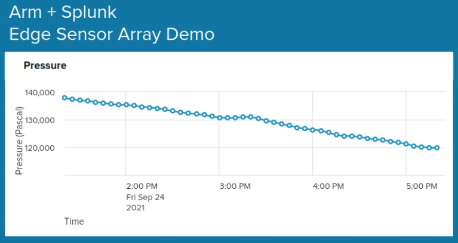

# Splunk Universal Forwarder on Arm Demo
This project contains everything needed to deploy the Splunk Universal Forwarder on an Arm based edge device, as well as deploying Splunk Enterprise in the cloud to index the Forwarder data. There are various README files in the subdirectories that help explain how to deploy this demo. We suggest starting with the contents of the Enterprise Directory. Note, this demo can be deployed with just about any Arm based board. Below, we use the Jetson Xavier NX as the example.

  

On the left we have the AWS cloud hosted part of this demo. It’s made up of a VPC and subnet hosted in the us-east-1 region. Within the subnet, we deploy an M6i instance (can be changed to any other instance) that is running Ubuntu which has Splunk Enterprise installed. The instance is connected to the public internet via an internet gateway and routing table that connects the instance to the public internet. On the right we have the edge hosted part of this use case. This includes the internet and a Jetson Xavier NX (can be any Arm board). The Jetson board has sensors attached to it which sample temperature, humidity, pressure, VOC gasses, and light intensity. The Jetson board also has the Splunk Universal Forwarder installed. The forwarder is configured to read samples of the sensor data and send it to Splunk Enterprise in the cloud for indexing. Once the data is indexed by Splunk Enterprise, we can search and visualize the sensor data. Below is a partial image of the dashboard showing the pressure data generated by the edge device. 

  

## Required Tools

[Terraform](https://www.terraform.io/) and [Ansible](https://www.ansible.com/) are required to deploy the demo. Be sure to install these tools. The various README files in this repo provide instructions on how to run Terraform and Ansible commands.

## Top level Directory Description
At the top level, we have 3 directories:

**python:**

The python directory contains the python code used to interface to the sensor boards we used for this demo. The README in this directory contains more information on the sensor boards. The read_sensors.py file will poll the sensors and print the readings to stdout. The readings are also written to /var/log/sensor_data. The sensor_data file is what is monitored by the Splunk Universal Forwarder software. 

The sensor boards are not a requirement to run this demo. You can write a mock data generator that writes to /var/log/sensor_data instead. The format of the data can be whatever you want, but a key-value pair structure makes the data more easily searchable and transformable on the cloud (Splunk Enterprise) side. If you decide to use a mock data generator, the easiest thing to do is to modify the read_sensors.py file. Simply bypass the code that reads the sensors and fill in your own data.

**enterprise:**

This is collateral for installing and running Splunk Enterprise. This is the cloud part of the demo. See the README for more information.

**fwd:**

This is collateral for installing the Splunk Forwarder on an Arm based edge device. This is the edge part of the demo. See the README for more information.
