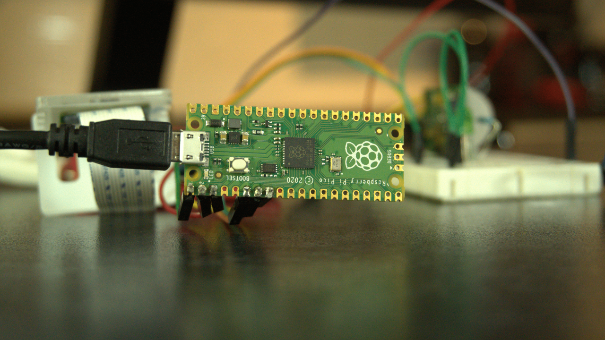

# Raspberry Pi Pico + RPi 4 for Intruder Detection

<!-- The Raspberry Pi Pico is wired to a motion sensor that turns on the Raspberry Pi 4 when movement is detected. When turned on, the Raspberry Pi 4 uses a face recognition algorithm to recognize human faces and compare the detected face with the familiar faces stored on the Pi. It then makes a post request to IFTTT to send a notification to your phone if a stranger is detected. The script then turns off the Raspberry Pi to conserve energy. This coordination is enabled via a cron job that executes the CV script automatically on boot. -->

<!--  -->

## Part 1: Testing Pico board and wiring up motion sensor 
Wire-up the sensor such that:
* GP1 - power to the LED
* GND1 - ground for LED
* GP4 - power to the sensor (VCC)
* GP5 - output of the sensor (OUT)
* GND2 - ground pin of sensor (GND)

save the "main.py" script on the Pico and run it. The LED should turn on when the motion sensor is activated.
## Part 2: Setting up RPi4 Computer Vision script, IFTTT and Cron job
Install the following [dependencies](https://gist.github.com/mrpjevans/9885e853b603ed046cbc5326b9942991) by following the instructions.
Save the startup_script.py on your Raspberry Pi and have an image of your face on the same folder.
Setup an IFTTT webhook.
Change the API key in the code to match your own API key and image name.
## Putting it all together 
Run the following command on your Pi's terminal:

``` sudo crontab -e```

Scroll down to the bottom of the file and place the following command:

``` @reboot cd /home/pi/Code && python3 /home/pi/Code/startup_script.py & ```

This should make the computer vision script execute on the Pi upon turning on.
Next, you'll do a bit of re-wiring to turn on the Pi from the Pico board by momentarily shorting pin 6 on the Raspberry Pi. First add a transistor which will act as a switch so that when we apply power from the Pico board on Pin 1, the current will flow from GPIO 5 to GPIO 6 on the Raspberry Pi, thus momentarily shorting it and turning the Pi on.

* Pico GP4 - power to the sensor (VCC)

* Pico GP5 - output of the sensor (OUT)

* Pico GND2 - ground pin of sensor (GND)

* Pico GP1 - Base (transistor)

* RPi4 GPIO5 - Emitter (transistor)

* RPi4 GPIO6 - Collector (transistor)

Note: this only works on the latest Raspberry Pi OS.

I know that this is probably not the best way to turn the Pi on and off so I'm looking to implement a better solution. If anyone has a suggestion for how to do this, please raise an issue on this repo with your proposed suggestion.

## Issues:
Looking for a better way to turn the Pi on/off.

## Extra: Testing serial connection between RPi4 and Pico 
https://unix.stackexchange.com/questions/42376/reading-from-serial-from-linux-command-line
